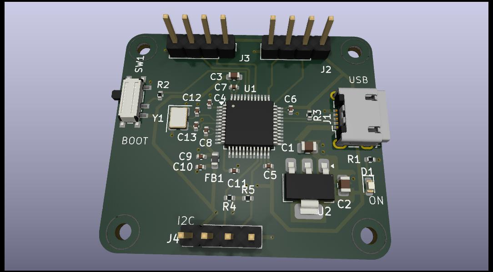

# STM32F103C8T6 Development Board

A two-layer SMD development board built around the STM32F103C8T6 (LQFP-48) microcontroller.
Designed from scratch in KiCad 9 as a learning exercise following Phil's Lab on Udemy.

---

## Board Preview



---

## Schematic

The schematic source is [`tproject.kicad_sch`](tproject.kicad_sch) (KiCad 9 S-expression format).
Open with **KiCad 9 Schematic Editor** or any compatible viewer.

To export a printable PDF from the command line:

```bash
kicad-cli sch export pdf tproject.kicad_sch -o docs/tproject-schematic.pdf
```

To export a vector image for web viewing:

```bash
kicad-cli sch export svg tproject.kicad_sch -o docs/
```

---

## Key Specifications

| Parameter | Value |
|-----------|-------|
| MCU | STM32F103C8T6, LQFP-48, 72 MHz Cortex-M3 |
| Flash / RAM | 64 KB / 20 KB |
| Supply | USB Micro-B (5 V) → AMS1117-3.3 LDO → 3.3 V |
| Clock | 16 MHz HSE crystal (Y1) |
| Connectors | J2, J3 — UART + power (2.54 mm); J4 — I2C (2.54 mm) |
| Debug | SWD via J2 (SWDIO/SWCLK) |
| USB | Full-Speed 12 Mbit/s via J1 (Würth 629105150521) |
| Boot select | SW1 — SMD SPDT (PCM12 footprint) |
| Board size | 38.54 × 33.17 mm |
| Layers | 2 (F.Cu signal + B.Cu GND plane) |
| Mounting | 4 × M2 holes |

---

## Bill of Materials

| Ref(s) | Qty | Value | Footprint |
|--------|-----|-------|-----------|
| U1 | 1 | STM32F103C8T6 | LQFP-48 7×7 mm P0.5 mm |
| U2 | 1 | AMS1117-3.3 | SOT-223-3 TabPin2 |
| Y1 | 1 | 16 MHz crystal | Crystal SMD 3225-4Pin |
| J1 | 1 | USB Micro-B | Würth 629105150521 |
| J2, J3, J4 | 3 | 4-pin header | PinHeader 1×04 P2.54 mm vertical |
| SW1 | 1 | SPDT switch | SW_SPDT_PCM12 SMD |
| C1, C2 | 2 | 22 µF | 0805 |
| C3 | 1 | 10 µF | 0603 |
| C4, C5, C6, C7, C11 | 5 | 100 nF | 0402 |
| C8 | 1 | 10 nF | 0402 |
| C9, C10 | 2 | 1 µF | 0402 |
| C12, C13 | 2 | 10 pF | 0402 |
| FB1 | 1 | 120 Ω ferrite bead | 0603 |
| R1, R3, R4, R5 | 4 | 1k5 | 0402 |
| R2 | 1 | 10k | 0402 |
| D1 | 1 | LED red | 0603 |
| H1–H4 | 4 | M2 mounting hole | MountingHole 2.2 mm |

Full machine-readable BOM: [`manufacturing/tproject.csv`](manufacturing/tproject.csv)

---

## Manufacturing Files

All Gerber, drill, and pick-and-place files are in [`manufacturing/`](manufacturing/).
The complete submission package ready for a fab house is [`manufacturing/tproject.zip`](manufacturing/tproject.zip).

| File | Description |
|------|-------------|
| `tproject-F_Cu.gbr` | Front copper |
| `tproject-B_Cu.gbr` | Back copper (GND plane) |
| `tproject-F_Mask.gbr` | Front solder mask |
| `tproject-B_Mask.gbr` | Back solder mask |
| `tproject-F_Paste.gbr` | Front solder paste / stencil |
| `tproject-F_Silkscreen.gbr` | Front silkscreen |
| `tproject-B_Silkscreen.gbr` | Back silkscreen |
| `tproject-Edge_Cuts.gbr` | Board outline |
| `tproject-PTH.drl` | Plated through-hole drill file |
| `tproject-NPTH.drl` | Non-plated (mounting hole) drill file |
| `tproject-top-pos.csv` | Pick-and-place centroid (top side) |

---

## Repository Structure

```
tproject.kicad_sch          ← Schematic (KiCad 9)
tproject.kicad_pcb          ← PCB layout (KiCad 9)
tproject.kicad_pro          ← Project file
tproject.jpg                ← Board 3D render
manufacturing/              ← Gerber, drill, BOM, PnP files
docs/
├── design-notes/           ← 20 design notes (0001–0020)
└── datasheets/             ← Component datasheets
step/                       ← STEP models (USB connector)
scripts/
├── gen_design_note.py      ← Schematic → design note markdown
└── design_note_to_kicad.py ← Design note markdown → schematic
```

---

## Design Notes

The design was documented step by step. Each note records the rationale, component
values, placement decisions, and routing details for that stage.

| # | Title |
|---|-------|
| [0001](docs/design-notes/0001-Decoupling.md) | Decoupling strategy |
| [0002](docs/design-notes/0002-Configuration-NRST-BOOT0.md) | NRST / BOOT0 configuration |
| [0003](docs/design-notes/0003-Crystal-circuitry.md) | HSE crystal circuitry |
| [0004](docs/design-notes/0004-USB-Micro.md) | USB Micro-B connector |
| [0005](docs/design-notes/0005-Power-Supply-and-Connectors.md) | Power supply and connectors |
| [0006](docs/design-notes/0006-Electrical-Rules-Check-and-Annotations.md) | ERC and annotations |
| [0007](docs/design-notes/0007-Footprint-Assignment.md) | Footprint assignment |
| [0008](docs/design-notes/0008-PCB-Setup.md) | PCB setup and design rules |
| [0009](docs/design-notes/0009-Initial-PCB-Component-Placement.md) | Initial component placement |
| [0010](docs/design-notes/0010-USB-SWO-Placement-Refinement.md) | USB / SWO placement refinement |
| [0011](docs/design-notes/0011-Switch-SMD-and-USB-STEP-Model.md) | SMD switch and USB STEP model |
| [0012](docs/design-notes/0012-Switch-Connector-Placement-Refinement.md) | Switch / connector placement refinement |
| [0013](docs/design-notes/0013-Power-Supply-Placement.md) | Power supply cluster placement |
| [0014](docs/design-notes/0014-Board-Outline-and-Mounting-Holes.md) | Board outline and mounting holes |
| [0015](docs/design-notes/0015-Routing-Decoupling-and-Crystal.md) | Routing — decoupling caps and HSE crystal |
| [0016](docs/design-notes/0016-Connector-Footprint-Fix.md) | Connector footprint fix (J2, J3, J4) |
| [0017](docs/design-notes/0017-Signal-Routing.md) | Routing — signal nets (UART, I2C, SWD, USB, BOOT0) |
| [0018](docs/design-notes/0018-Power-Routing.md) | Routing — power nets |
| [0019](docs/design-notes/0019-Silkscreen.md) | Silkscreen and zone fill |
| [0020](docs/design-notes/0020-BOM-and-Gerber-Export.md) | BOM and Gerber export — final stage |

---

## Tools

- **KiCad 9** — schematic capture and PCB layout
- **Python 3** — design note generation scripts (see [`docs/README.md`](docs/README.md))

---

## License

Hardware design files are released under [CERN-OHL-P v2](https://ohwr.org/cern_ohl_p_v2.txt).
